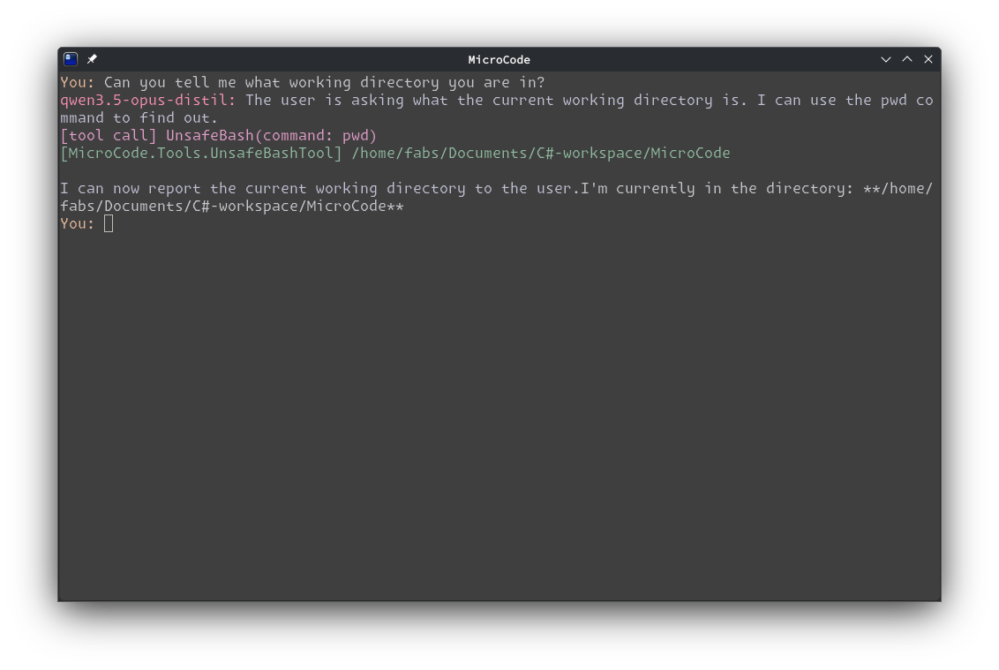
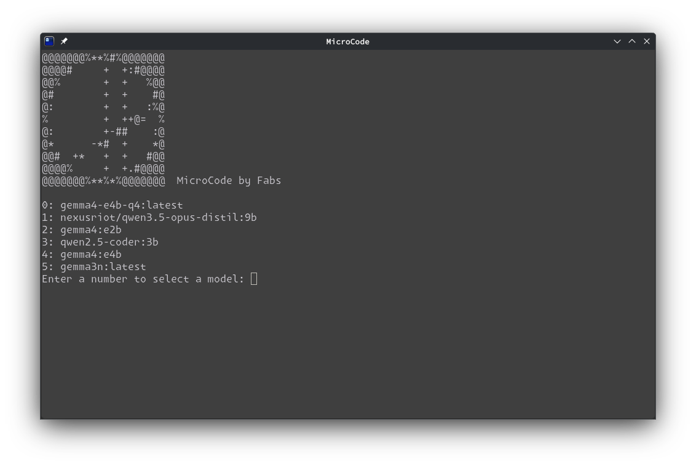

# MicroCode

MicroCode is a small C# console app that connects to a local Ollama server and runs an interactive chat session with tool support.

## Requirements

- .NET 10 SDK
- [Ollama](https://ollama.com/) running locally on `http://localhost:11434`
- Model with thinking and tool calling.

## Run

```bash
dotnet run
```

Type your prompt at the `You:` prompt. Type `exit` or `quit` to close the app.

## Example Outputs

The following images show example outputs from the application:





## Notes

- Currently includes an unsafe bash tool (an unrestricted bash tool with user permissions. Use at your risk).
- The app uses `OllamaSharp` to talk to a local Ollama instance.
- A sample weather tool is included under `Tools/`.
- If you want to use a different Ollama host or model, update `Program.cs`.

## License

This project is licensed under the MIT License. See `LICENSE` for details.
